# 1. 输入输出接口形状更改

目前输入输出端口都是圆形，为减少玩家的困惑，应该参考下面的示意图进行形状更改：

初始状态下，输出端为外侧有三角形尖角的圆形，而输入端为外侧扣除三角形的圆形。

玩家拖动端口时，输入端的尖角圆形和鼠标一起移动

输入和输出端口接上时，端口合并为一个完整的圆形

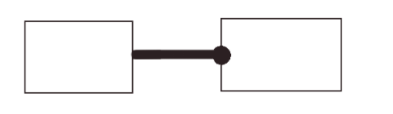

# 2.带有假设的连线颜色修改

现在封程机的假设输出端口、汇路机的两个假设输出端口拖出的连线都是有一半为粉红色。我希望改为从假设输出端口开始，所有连线只要依赖于没有被消去的假设，就都需要显示为粉红色。也就是说能让玩家清楚第看出哪些连线因为有没消去的假设依赖，是不可以直接接入结论节点的。

# 3.连线提示修改

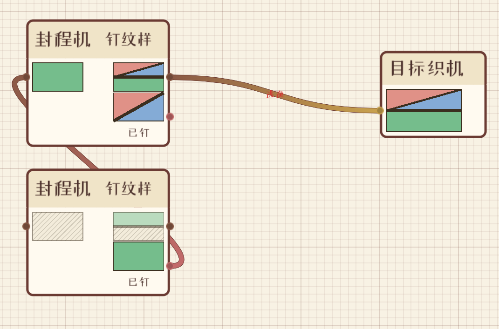

现在如果玩家给输入端口连入了错误的输出端口也是能连上的，只是在连线中间用文字显示问题。

我希望做出以下更改：

- 首先错误文字提示的大小需要扩大至少一倍，加上白色描边。现在的文字太小了看不清楚。

- 玩家如果进行了错误的节点连线，连线应该在0.5秒后自动断开。文字提示则停留一秒后淡出

# 4.节点内部交互改进

## 4.1纹样预览间隔调整

首先所有上下并排放的纹样预览间隔都需要拉开，现在间距太小了，可以参照下图的间隔

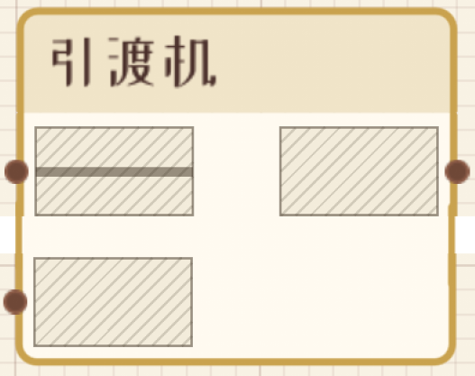

## 4.2纹样预览外边框颜色提示

玩家现在还是不能很好地理解每个节点的输入和输出规则。我希望为每个节点的纹样预览都增加按照子命题构成不同而不同颜色的边框。

比如对于引渡机，输入A蕴含B和A，输出B。那么迭层纹输入的上半部分边框和另一个输入的边框应该是一个颜色（如C9A24E），迭层纹的下半部分和输出边框应该是另一个颜色（如775241），参考下图：

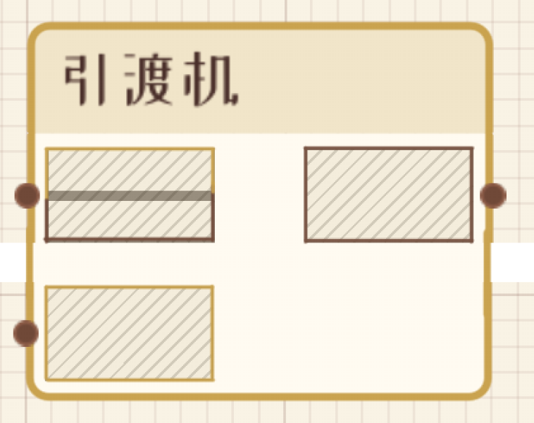

并织机可参考下图：

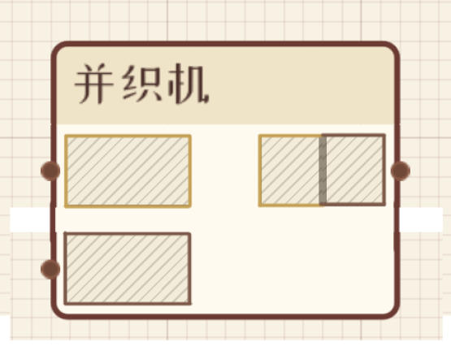

拆股机：

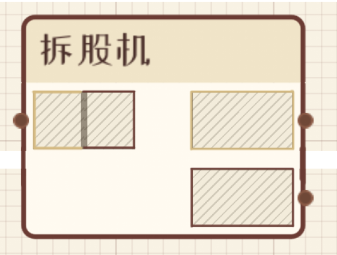

汇路机：

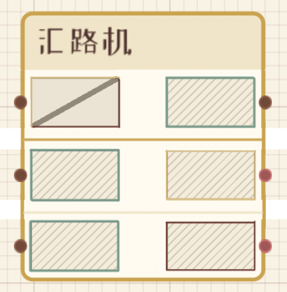

## 4.3汇路机结构

如上一节最后一张图所示，汇路机的三行之间应该有分割线隔开（我使用的颜色是C9A34F和F2E7CE）

## 4.4封程机结构

封程机结构需要参照下图进行调整。整体应该呈现凹形，假设（A）和证明出的结果（B）应该放在第一排，结论输出（A蕴含B）单独放在第二排，标题放在最底部。

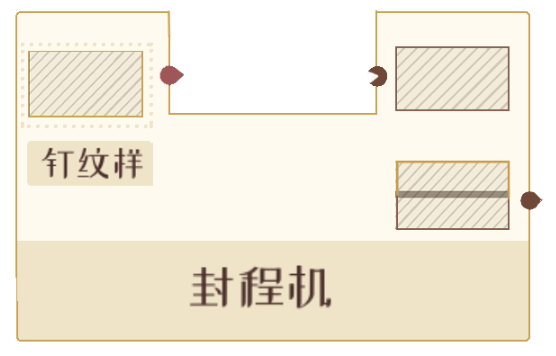

## 4.5钉纹样交互修改

参考下面几张示例图，“钉纹样”按钮应该有背景底色而不是纯文字。按钮应该显示在节点内部的被钉纹样预览旁边而不是标题上。

不需要“已钉”这个文字提示。未被指定时在预览纹样外侧再增加一圈蚂蚁线边框，已被指定时不显示。

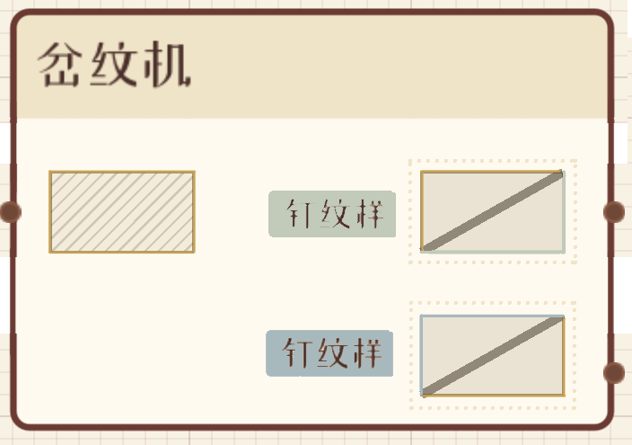

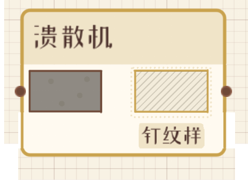

## 4.6钉纹样界面内部修改

参考我的示意图，需要改动以下几个地方：

1. 需要调整窗口的大小，适应内容。目前下方有大量空白区域。

2. “选笔刷，点纹样；斜纹处是未染的孔”这个提示词语可以删去

3. “挖回孔”这个功能删掉

4. “清除钉住”，“取消”，“钉住”。改为“清空”“取消”“确认”。按钮需要有背景色，不能是纯文字。

5. 纹样和笔刷之间单独一行标注“笔刷：”

6. “并织”、“岔纹”和“迭层”需要改为对应的图像示意。

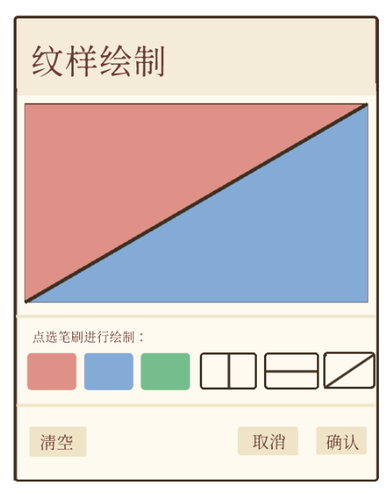

# 5.笔记自动弹出

当进入一个关卡时，若某个仪器是这一关第一次出现，则应该自动弹出笔记窗口的对应条目。

