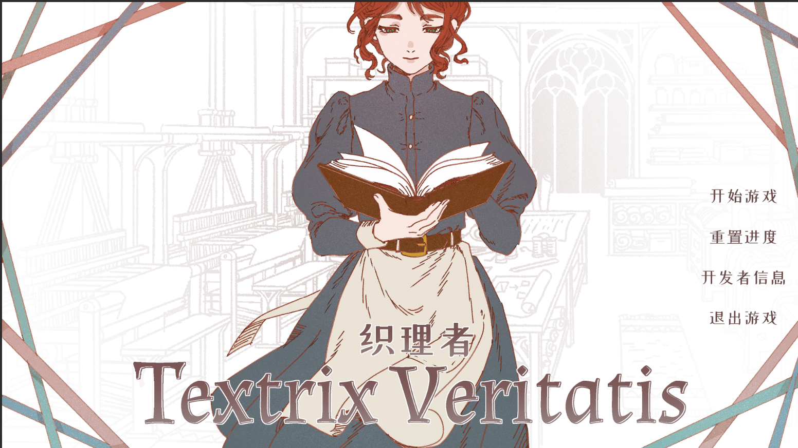
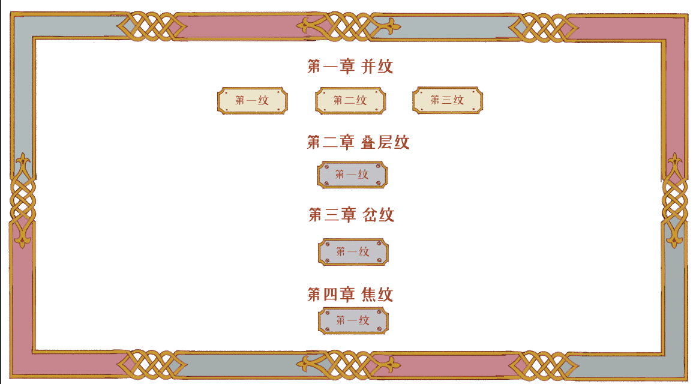
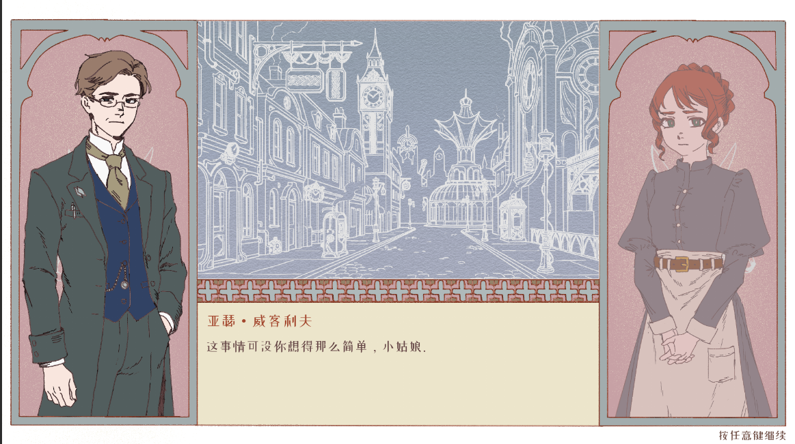
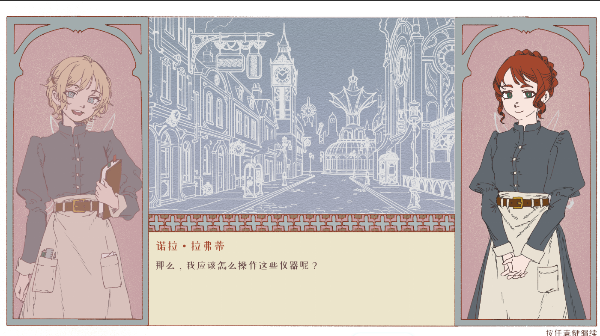
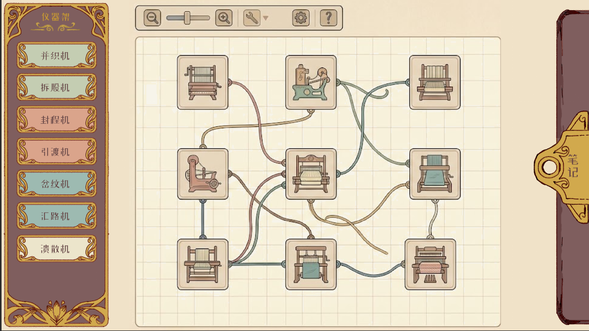
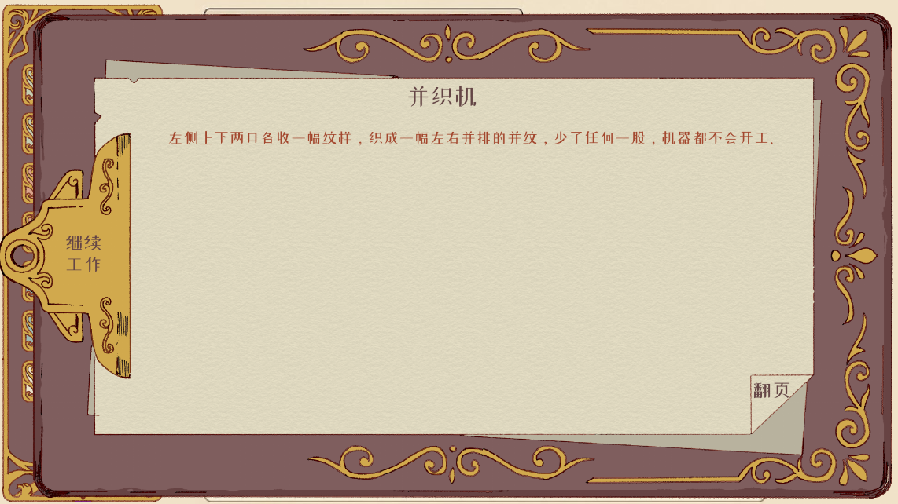

游戏中所有文字如无特别标注统一使用我文件夹中的zcool xiaowei体。

所有图片素材，如无特别标注请直接参照预览图使用我文件夹中的png图，不要更改图片的大小和长宽比，并告知我应该在引擎中哪个位置手动调整图片的位置细节。

对于游戏中的没有底图只有文字的按钮，玩家鼠标悬浮到按钮碰撞体（文字附近）时，文字应该变浅，鼠标离开时恢复。否则玩家可能不知道这是按钮。

# 标题页面

标题界面包括：

- 整张背景图

- 标题（图片）

    - 如果可以的话给整个标题图片加一个微弱的表面流光的shader效果

- 功能选项

    - 玩家无存档/重置后进入游戏，第一个选项显示为“开始游戏”，点击开始游戏后跳转到选关界面。如果玩家已经游玩过一关，则第一个选项显示为“继续游戏”，点击后依然跳转到选关界面，不要直接进关卡。

    - 重置进度：点击后重置玩家进度

# 选关界面

使用三种图片素材：选关界面底图、关卡底图（已解锁）和关卡底图（未解锁）

初始即显示所有的章节和关卡，但是后续关卡只有在玩家完成全部前置关卡后才能解锁。现在关卡的数量不用按照我这张图来，但是章节参照这张图来命名，关卡也是，直接“第一纹”、”第二纹“这样命名就可以了，不要自己取名字。

# 开发者信息界面

和选关界面采用相同底图，上面只放文字，用来展示作者和使用的免费素材、参考的作品等，可以先写占位符

# 故事界面

故事界面包括一整张不变的底图、场景插图、人物立绘以及对话文字显示区域。

- 我之后会给一张excel表，规定每个关卡剧情中每一条对话时的发言人、场景、语句内容、以及左侧的人物（有可能为空）。主角诺拉一直处于右侧的立绘点位

- 两个人物同时在场时，没有在说话的人身上需要按照50%的透明度叠一张遮罩图，图片和立绘位置要完全重合（我会给出遮罩图）

- 现在的对话界面中不要显示场景文字名称。

# 关卡内界面

- 仪器架界面和笔记窗口请严格使用我的图片素材，并织机等器械对应的按钮、按钮的分配也严格按照这张图。但是中间的节点部分仅做颜色和样式的示意，功能结构依然按照现在的来。但是要仿照这个参考图一样使用深色（棕红）描边、白色、乳黄色做大底色的风格。

- 节点内所有P、Q等公式和命题都删除，不要让玩家知道图像对应的公式。

- 不用显示现在在哪一关

玩家点击“笔记”时右侧的笔记窗口向左划出。“笔记”变为“继续工作”，点击“继续工作”则回到笔记未划出的状态。

玩家点击“翻页”进入下一条教程条目，如果到最后一条就回到第一条。

现有的笔记条目全部删除，换成现在点击织机会跳出的说明弹窗的内容（先仅文字）。点击织机跳出说明弹窗这个功能删掉。

